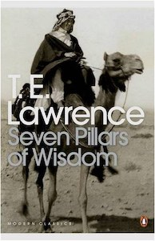

2020 年真是相当难以忘怀的一年。记得年初回到家，仍觉得是寻常的新一年。之后疫情不断升级，也逐渐适应了线上的授课和工作。四月份和友人在街头散步，全城开始鸣笛哀悼，那一刻才恍然意识到：世界在这一年被永远地改变了。至于我自己的生活，在这一年里也是按部就班符合预期，但是今年在大疫之中看了一些不错的书，想推荐一下。

---

**智慧七柱**（Seven Pillars of Wisdom）

> 阿拉伯沙漠。由飄砂與滾燙巨石組成的一片汪洋。在這些沙丘之下，蘊藏著黑色金礦石油。400 多年来，鄂圖曼帝国統治了阿拉伯沙漠，但鄂圖曼的統治並非從未遭到抵抗，一小股贝都因反抗军集結起來要推翻帝國。他們出手毫無預兆，並且出擊完就消失在沙漠當中。跟他們一同作戰的，還有一位英國軍官，他立下的功勛讓他有廣為人知的聲望。全世界的人都叫他——阿拉伯的勞倫斯。
