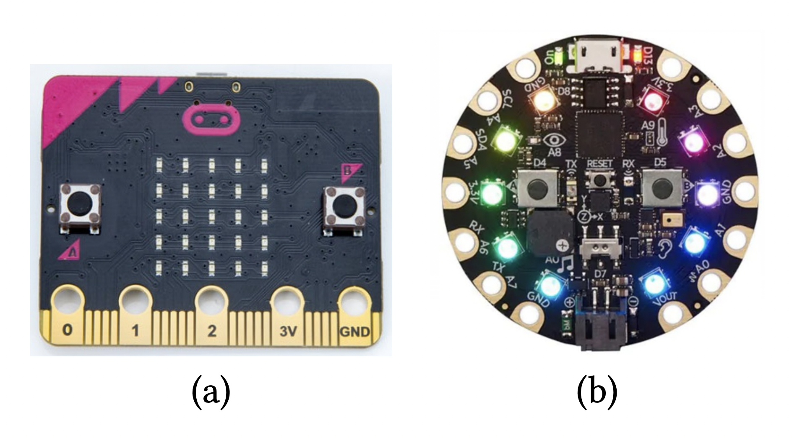
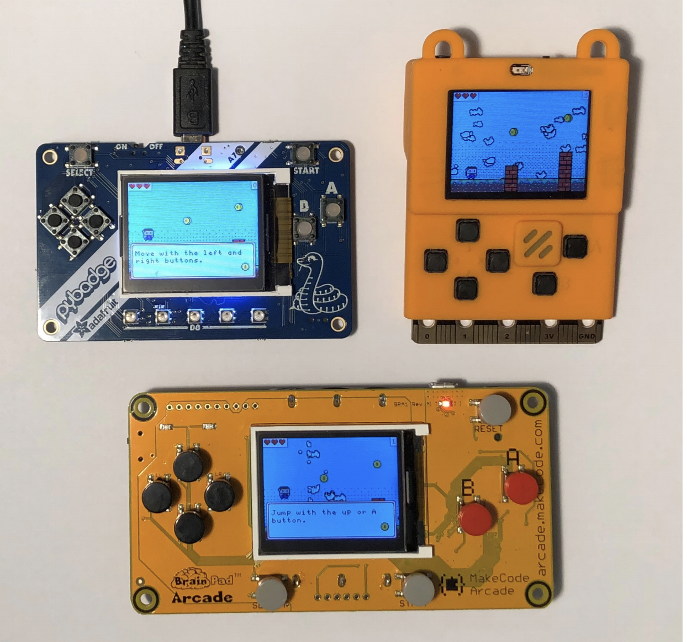

译者声明：本译文获得原作者授权翻译。

作者：

1. **Thomas Ball**，微软研究院，Redmond，tball@microsoft.com

2. **Peli de Halleux**，微软研究院，Redmond，jhalleux@microsoft.com

3. **Michał Moskal**，微软研究院，Redmond，mimoskal@microsoft.com

## 综述

基于单片机的嵌入式设备通常使用 C 语言进行编程。这类设备正在进入计算机科学教学的课堂，甚至一些中学也开办了相关课程。于是，用于单片机编程的脚本语言（如 JavaScript 和 Python）使用也逐渐增加。

我们研发了 Static TypeScript（STS），它是 TypeScript 的一种子集（而 TypeScript 本身是 JavaScript 的超集），还研发了相关的编译/链接工具链，它们全部使用 TypeScript 进行开发并且在浏览器中运行。STS 为实践而设计（特别是实践教学），适合针对小型设备的静态编译。用户编写的 STS 程序将在浏览器中被编译成机器码，并链接预编译的 C++运行时，生成比普通的嵌入式解释器更高效的可执行文件，从而延长电池寿命并可以在 RAM 低达 16kB 的设备上运行（例如 BBC micro:bit）。本论文主要对实现 STS 系统和适用于课堂教学的嵌入式编程平台的技术挑战进行综述。

**关键词：**JavaScript，TypeScript，编译器，解释器，单片机，虚拟机

## 1 简介

近来，课堂上计算机的实物教学不断地发展，鼓励孩子们构建自己的简单的交互嵌入式系统。例如，图 1（a）展示了 BBC micro:bit[1]，它是一种受 Arduino 启发的小型可编程计算机，拥有集成的 5X5 LED 显示点阵、几个传感器和低功耗蓝牙（BLE）无线传输。该设备与 2-15 年首次向英国所有 7 年级学生推出（10 至 11 岁），随后走向全球，迄今为止已经通过 micro:bit 教育基金会（https://microbit.org）发放了四百万个设备。图1（b）则展示了另一个以RGB LED 为特点的教育设备 Adafruit’s Circuit Playground Express (CPX)。



**图 1** 两个 Cortex-M0 的单片机教育设备：(a) BBC micro:bit 拥有包含 16kB RAM 和 256kB 闪存的 Nordic nRF51822 微控制单元；(b) Adafruit’s Circuit Playground Express (https://adafruit.com/products/3333) 拥有包含 32kb RAM 和 256kB 闪存的 Atmel SAMD21 微控制单元。

研究表明在计算机科学教育中使用这样的设备会增加对孩子们的吸引力，尤其是对于女生，还可以增加孩子们和老师们的自信，让课堂教学更加生动[2,16]。

为了控制课堂教学的成本，这些设备一般使用 16 到 256kB 的 32 bit ARM Cortex-M 单片机，使用额外的计算机（通常是笔记本电脑或台式机）进行编程。在课堂上用这类设备进行编程教学有一系列技术挑战：

> 1. 选择/设置合适该年龄段学生的编程语言和开发环境
> 2. 教室的计算机使用的操作系统通常是过时的，互联网连接也不稳定或速度慢，并且可能被学校的 IT 管理员限制访问外部网络，这使得安装原生应用程序有种种困难
> 3. 学生开发的程序要从计算机转移到电池供电的嵌入式设备上（正如很多项目都在实验中提供这种设备，若没有提供也可以“改造”。）

面对这些挑战，有许多流行脚本语言的嵌入式解释器应运而生，例如 JavaScript 的 JerryScript[8,15]、Duktape[22]、Espruino[23]、mJS[20]、MuJS[19]，Python 的 MicroPython[9]及其分支 CircuitPython[12]。这些解释器直接在微控制器上运行，仅依赖从计算机向嵌入式设备传输程序文本；但它们也舍弃了深度优化的 JIT 编译器（如 V8）的一些优势，这类编译器运行需要的内存比单片机的内存要大两个数量级。



**图 2** 三款有 160x120 分辨率彩色屏幕的基于单片机的游戏机，这些开发板使用 ARM 的 Cortex-M4F 核心：ATSAMD51G19（192kB RAM，以 120Mhz 主频运行）和 STM32F401RE（96kB RAM，以 84Mhz 主频运行）。

很不幸的是，这些嵌入式解释器逗比 V8 慢几个数量级（详细对比见第 4 节），影响响应速度和电池寿命。更重要的是，由于内存中的对象表示为动态键值映射（dynamic key-value mappings），因此它们的内存占用量可能是实现同样功能的 C 程序的几倍，这一点严重限制了程序在更低内存的机器上(如 16kB RAM 的 micro:bit 和 32kB RAM 的 CPX)运行的可能性。

### 1.1 Static TypeScript

作为上述嵌入式解释器的替代，我们开发了 Static TypeScript（STS），它是 TypeScript 的语法子集[3]，由一个用 TypeScript 编写的编译器支持，该编译器可以生成在 16-256kB RAM 的微控制器上高效运行的机器码。STS 及其编译器和运行时的设计主要着力于解决前文提到的三个挑战。确切来说：

> - STS 削除了 JavaScript 大部分的「糟粕」；受 StrongScript 影响[14],对于静态声明的类，STS 使用名义类型（nominal type），并支持用虚拟函数表的经典技术对类进行高效编译。
> - STS 工具链是离线运行的，在浏览器第一次加载，而不需要 C/C++编译器。它们用 TypeScript 实现，讲 STS 编译为 ARM Thumb 机器码并在浏览器中将其与预编译好的 C++ 运行时链接————浏览器或许在大多数时候是课堂中唯一可用的运行环境了。
> - STS 编译器的生成的机器码令人欣喜的高效和紧凑，使我们解锁了一系列应用领域，例如图 2 中所示的低配置设备的游戏编程，它们能够运行全都得益于 STS。

将 STS 用户程序部署到嵌入式设备不需要安装特别的应用或设备驱动，只需要进入浏览器即可。完成编译的程序以文件下载的形式显示，然后用户将文件传输到显示为 USB 存储器的设备中即可（或者直接通过 WebUSB 协议传输，它是一种即将推出的将网站与物理设备连接的协议）。

STS 简单编译的编译方案（将在第 3 节详述）在一系列小型 JavaScript 基准测试中取得了惊人的优秀表现，性能可以和 V8 等先进前沿的 JIT 编译器媲美，而所需的内存则比他们低几个数量级（详情见第 4 节）；同时，也比嵌入式解释器快至少一个数量级。评估的一个特别之处是对处理类、接口和动态映射（dynamic maps）的字段/方法查找的不同策略的比较。

### 1.2 MakeCode：为教学而生的简单嵌入式开发

STS 是 MakeCode 框架（详情见https://makecode.com；该框架及诸多编译器已按MIT协议开源，请见https://github.com/microsoft/pxt）支持的核心语言。MakeCode支持为单片机设备创造自定义的嵌入式编程实验。每个MakeCode实验（我们一般称其为编辑器（editors），虽然它们也包含了模拟器、API、教程、文档等）通过STS针对特定设备或设备类型进行编程。

大多数 MakeCode 编辑器主要以 Web 应用的形式部署，其中包含了用以开发 STS 程序的功能齐全的文本编辑器，它基于 Monaco（VS Code 使用的编辑器组件）；还包含了基于 Google Blockly 框架的图形化编程界面（注释中的 STS 元数据定义了 STS 的 API 到 Blockly 的映射，MakeCode 会在 Blockly 和 STS 之间进行交互）。

MakeCode 编辑器和原先 BBC micro:bit 和 Adafruit CPX（详情见https://makecode.microbit.org/和https://makecode.adafruit.com/）的编程实验至今已经覆盖了全球的数百万学生和教师。

STS 支持包（package）的概念，即 STS、C++、汇编代码文件的集合，并支持把其他的包当做依赖。第三方开发者已经利用这样的能力对 MakeCode 编辑器进行扩展，使之可以支持各种开发板的外接设备（micro:bit 的相关示例见https://makecode.microbit.org/extensions）。值得注意的是，大多数包完全用STS编写从而避免了不安全C/C++的陷阱，这主要得益于STS编译器的高效和底层STS API 对通过数/模针脚（GPIO、PWM、servos）和一些协议（I2C 和 SPI）实现的访问硬件的高可用性。

图 3 展示了用来为图 2 中的手持游戏设备进行编程的 MakeCode Arcade 编辑器（事实上，图中编辑器里的 STS 程序就是在三个单片机设备中运行的游戏之一，它是一个简单的平台游戏）。MakeCode Arcade 包含了一个大部分由 STS 编写的游戏引擎，因此对代码运行效率提出了很高的要求，因为要在高帧率下实现令人快活的视觉效果。该游戏引擎包含游戏循环逻辑、事件上下文栈、物理引擎、文字线条绘制等模块以及用于特定游戏的框架（比如，为图中的特定的平台游戏），游戏引擎一共由一万行 STS 代码和少数最基础的 C++ 图像模糊函数组成。该游戏用 Arcade 构建，在浏览器（桌面或移动端）运行，或在不同型号但符合配置要求的单片机上运行（160\*120 像素 16 色屏幕和 100MHz 左右主频、100kB RAM 左右的微控制器）。

**图3**

本文的主要目的是详述了该广泛部署的系统和解决上述课堂教学难题的方法。

## 2 Static TypeScript(STS)

TypeScript[3]是 JavaScript 的渐进式[18]超集。这意味着所有 JavaScript 程序都是 TypeScript 程序并且其类型是可选的、按需添加的，这些类型可以让 IDE 提供更好的支持，也能让大型 JavaScript 程序有更好的错误检测（error checking）。对象类型提供了映射（maps）、函数和类的统一形式。对象类型之间的结构子类型（structural subtyping）定义了可替换性（substitutability）和兼容性检查。经过类型擦除（及较小的语法转换）后生成原始的 JavaScript 程序。

### 2.2 包（Packages）

STS 支持多种输入文件，也支持 TypeScript 的`namespace`语法用以区分作用域

## 3 编译器和运行时

STS 的编译器和工具链（链接器等）完全使用 TypeScript 编写。现在尚不支持单独编译 STS 文件，STS 是一个完整的程序编译器（支持缓存预编译的包，其中包含了 C++ 运行时）。STS 的设备运行时主要是由 C++ 编写的，包含定制的垃圾回收器。正如前文提到的，STS 并不计划支持 JavaScript 的全部功能。

### 3.1 编译工具链

TypeScript 源程序由常规 TypeScript 编译器处理，执行包块类型检查在内的语法和语义分析；这个过程产出有类型注释的抽象语法树（AST），然后检查是否有 STS 范围之外的构造（类似`eval`和`arguments`等）。抽象语法树随后会转化为具有语言构造的自定义 IR 用以调用运行时函数。这种 IR 之后回北转换为下列的三种形式之一：

1. 继续传递 JavaScript 运行到浏览器中（在单独的 iframe“模拟器”里）。

2. 与预编译的 C++ 运行时链接的 ARM Thumb 机器码，用以在裸机（A 'bare-metal server' is a computer server that is a 'single-tenant physical server'. The term is used nowadays to distinguish it from modern forms of virtualisation and cloud hosting.）硬件和操作系统内部运行。

3. 自定义虚拟机的字节码，用于无法加载或生成动态语言的平台（例如 XBox 和 iOS）。

ARM Thumb 机器码和自定义的字节码全都被生成为汇编代码，再由定制的汇编器转换为机器码。在本节中我们主要讨论原生 32-bit ARM Thumb 的转化过程（我们会在 4.2 节对比虚拟机的性能）。

本段提到的常规的 TypeScript 编译器、STS 代码生成器、汇编器（assembler）、链接器（linker）均由 TypeScript 实现并且全部运行在浏览器或命令行中。

### 3.2 链接

生成的机器码将与一个预编译的 C++ 运行时链接。C++ 的编译在云上运行，编译生成的运行时缓存在 CDN 和浏览器中（可以选择使用所有 C++源码的强哈希算法进行缓存）。通常来说，用户编写他们的程序时，C++ 运行时不会更改，从而让离线操作成为可能[5]。

生成的机器码通常会附加在预编译 C++ 运行时代码的后面，根据目标设备要求的文件格式（特别是 ELF）对生成文件进行一些修补。为了生成代码，汇编器需要运行时函数的地址，这些地址从运行时的二进制文件提取。

包可能还要包含从运行时中继承出来的 C++ 代码。包含 C++ 的包组合都必须分别进行编译和缓存，这些也都是在云上运行的。到目前为止，这些可能是天量数字的包组合方式还没有出现大问题，因为学生一般不会一次使用很多外部的包，而且我们的经验是，为 MakeCode 编写的包很少使用原生 C++。

### 3.5 算术运算符

一些算术运算符被编写为快速整数路径的汇编提高运行速度；以下是运算符`+`的实现：

```assembly
_numops_adds:
    ands r2, r0, r1 ; r2 := r0 & r1
    ands r2, #1 ; r2 &= 1
    beq .boxed ; last bit clear?
    subs r2, r1, #1 ; r2 := r1 - 1
    adds r2, r0, r2 ; r2 := r0 + r2
    bvs .boxed ; overflow?
    mov r0, r2 ; r0 := r2
    bx lr ; return
.boxed:
    mov r4, lr ; save return address
    bl numops::adds ; call into runtime
    bx r4 ; return
```

其它由特别实现的算术运算符有`-`、`|`、`&`、`^`和整数转换（调用 C++ 运行时函数时使用）。这些特别的汇编程序比始终调用 C++ 函数要快约两倍。我们在 4.3 节对乘法的性能做了比较。
除此之外的运算符则用 C++ 实现为使用整数、限制范围的数值和其它类型的抽象值的函数。

### 3.6 内置对象（built-in）的表示

**数组（Arrays）** 和 C++标准向量（vector）类似，但有相对保守的增长策略并且不支持稀疏数组（sparse array）。包括范围检查在内的简单数组访问操作用用汇编实现。设计索引转换和数组增长的情况用 C++ 运行时处理。缓冲区只是具有汇编字节访问器和用 C ++ 实现的许多实用程序函数的内存连续块。

**字符串（Strings）** 会有四种不同的表示，它们的开头都毁有一个虚函数表（v-table）指针。所有的字符串当前被限制为最大占用 65,535 字节的空间。ASCII 字符串（所有在 0-127 范围内的字符）用长度前缀加 NUL 中止的字符数据表示（其内部仍然可以有 NUL，只是为了方便 C++ 函数使用所以添加最后的 NUL）。较短的 Unicode 字符串使用 UTF-8 的可变长度编码，它们拥有不同的虚函数表。索引方法可以即时解码 UTF-8。

### 3.7 窥孔优化

### 3.8 垃圾回收器

## 4 性能评估

## 5 相关的工作

Safe TypeScript[13]和 StrongScript[14]都通过运行时类型检查支持了完整的 TypeScript 的类型系统。我们的工作最接近 StrongScript，因为 STS 使用类的名义解释（nominal interpretation）进行代码生成，且 STS 运行时会区分动态对象和类对象，分别生成 JavaScript 的`{x=...}`语法和`new C(...)`语法。

STS 和 StrongScript 也有一些区别，首先，StrongScript 的类型

## 6 总结

Static TypeScript（STS）填补了嵌入式编译器中一个有趣的空白。STS 的工具链完全由 TypeScript 实现，使之可以在浏览器运行并能为覆盖大部分 TypeScript 功能的子集成成 ARM（Thumb）机器码。STS 利用类的名义类型解释（nominal interpretation）提高编译代码的效率。有赖于 MakeCode，STS 现已广泛运行在许多低 RAM 的设备上。一组对 STS 的小型基准评估表明，STS 生成的代码比各种脚本语言的嵌入式解释器的运行速度要快得多。迄今为止最大的 STS 应用程序是 MakeCode Arcade，其游戏引擎有超过 10,000 行 STS 代码。

**致谢** 我们要感谢 MakeCode 团队的成员和前成员：Abhijith Chatra、Sam El-Husseini、Caitlin Hennessy、Steve Hodges、Guillaume
Jenkins、Shannon Kao、Richard Knoll、Jacqueline Russell、Daryl Zuniga。我们还要感谢 Lancaster 大学的 James Devine 和 Joe Finney，他们开发的 CODAL 是 STS 的 C++运行时的一部分。最后，我们还要感谢匿名审稿人的评论，并感谢 Edd Barrett 帮忙润色本文的最终版本。

---

[1]: Jonny Austin, Howard Baker, Thomas Ball, James Devine, Joe Finney,Peli de Halleux, Steve Hodges, Michal Moskal, and Gareth Stockdale. 2019. The BBC micro:bit – from the UK to the World. Commun. ACM(to appear) (2019).

[2]: BBC. 2017. BBC micro:bit celebrates huge impact in first year, with 90% of students saying it helped show that anyone can code. https://www.bbc.co.uk/mediacentre/latestnews/2017/microbit-first-year.

[3]: Gavin M. Bierman, Martín Abadi, and Mads Torgersen. 2014. Understanding TypeScript. In ECOOP 2014 - Object-Oriented Programming - 28th European Conference, Uppsala, Sweden, July 28 - August 1, 2014.Proceedings. 257–281. https://doi.org/10.1007/978-3-662-44202-9_11

[5]: 尽管我们可以使用 Emscripten 或类似的技术在本地对 C++ 进行编译，但编译工具链、头文件和相关的库可能需要数十兆的下载请求，导致浏览器的离线缓存空间紧张。

---
